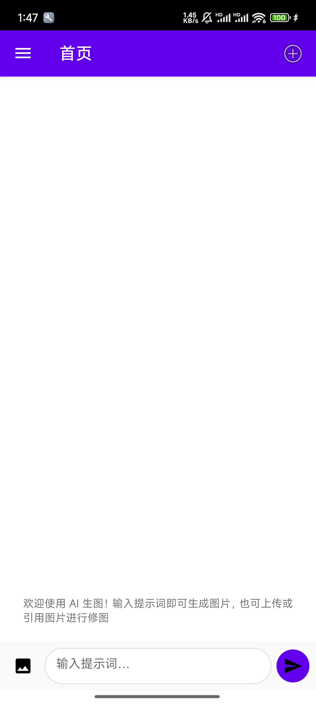
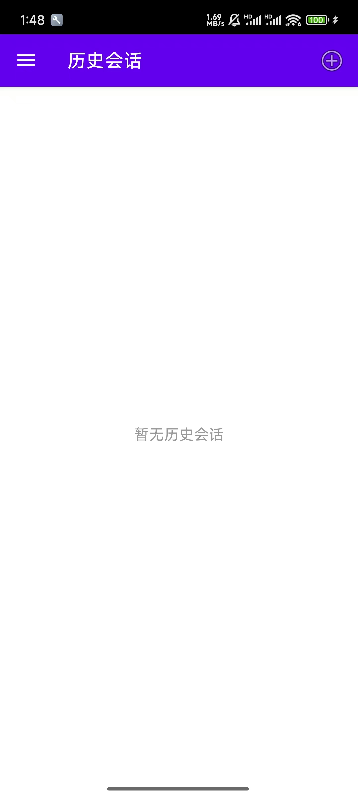
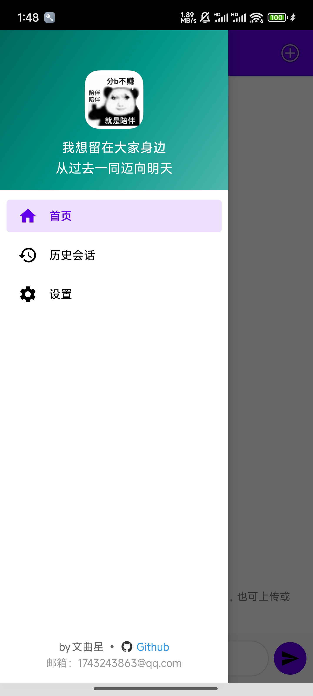
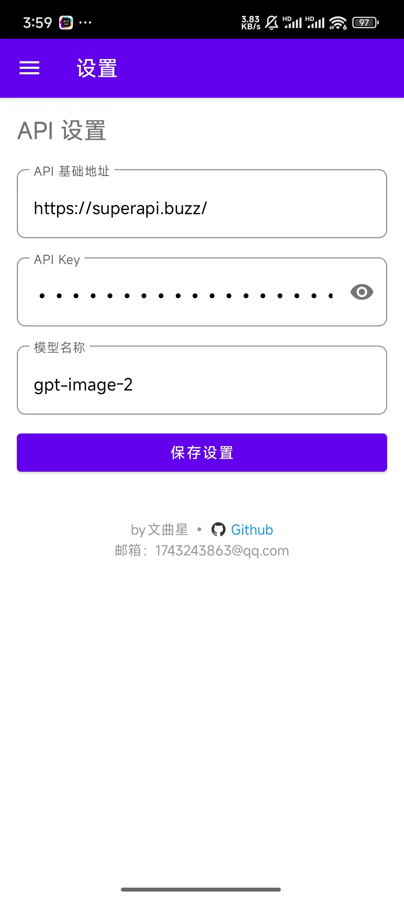

# Android AI Image Studio

<p align="center">
  
  
  
</p>

一款基于 Android 的 AI 图片生成与编辑应用，支持文生图（Text-to-Image）和图生图（Image-to-Image），兼容 OpenAI DALL-E API 及其他兼容接口。

## ✨ 功能特性

- 🎨 **文生图**：输入文字描述，AI 自动生成图片
- 🖼️ **图生图**：支持从相册选择或引用聊天中的图片进行 AI 编辑
- 🔄 **5 步智能重试**：图生图采用 5 种不同的 API 调用策略，自动降级以提高成功率
- 💬 **历史会话**：保存聊天记录，回顾已生成的作品，随时继续创作
- ⚙️ **灵活配置**：支持自定义 API 地址、模型、图片尺寸和质量
- 🌐 **语言支持**：原生中文 UI

## 📸 应用截图

<table>
  <tr>
    <td align="center"><br/>AI 对话</td>
    <td align="center"><br/>图生图</td>
    <td align="center"><br/>历史会话</td>
  </tr>
  <tr>
    <td align="center"><br/>侧边菜单</td>
    <td align="center"><br/>设置</td>
    <td></td>
  </tr>
</table>

## 🛠️ 技术栈

| 技术                 | 说明           |
| -------------------- | -------------- |
| Java                 | 主要开发语言   |
| AndroidX             | Jetpack 组件库 |
| Navigation Component | 页面导航       |
| OkHttp 4             | 网络请求       |
| Gson                 | JSON 解析      |
| Glide 4              | 图片加载与缓存 |
| Material Design      | UI 设计规范    |

## 📋 系统要求

- Android 7.0 (API 24) 及以上
- 需要配置兼容 OpenAI 格式的 AI API 服务

## 🚀 快速开始

### 📥 下载

[点击此处下载最新版本 APK](https://github.com/Wenquxing884/Android-AI-Image-Studio/releases/latest)

### 1. 克隆项目

```bash
git clone https://github.com/Wenquxing884/Android-AI-Image-Studio.git
cd Android-AI-Image-Studio
```

### 2. 用 Android Studio 打开项目

使用 Android Studio（建议最新稳定版）打开项目根目录，等待 Gradle 同步完成。

### 3. 配置 API

在应用的 **设置** 页面中配置以下信息：

| 配置项       | 说明               | 示例                     |
| ------------ | ------------------ | ------------------------ |
| API 基础地址 | API 服务的基础 URL | `https://api.openai.com` |
| API Key      | 你的 API 密钥      | `sk-xxxxxxxxxxxx`        |
| 模型名称     | 使用的 AI 模型     | `gpt-image-1`            |

### 4. 构建运行

连接 Android 设备或启动模拟器，点击 Run 即可。

### 5. 签名配置（可选）

如需构建 Release 版本，请在项目根目录创建 `local.properties` 并添加：

```properties
KEYSTORE_PASSWORD=your_password
KEY_ALIAS=your_alias
KEY_PASSWORD=your_key_password
```

将签名文件放置于 `app/keystore/release.keystore`。

## 📂 项目结构

```
app/src/main/java/com/example/mynavigation/drawer/
├── MainActivity.java              # 主 Activity
└── ui/
    ├── aigc/
    │   └── AigcApiService.java    # AI API 核心服务
    ├── home/
    │   ├── HomeFragment.java      # AI 生图主页面
    │   ├── HomeViewModel.java     # 主页面 ViewModel
    │   ├── ChatAdapter.java       # 聊天消息适配器
    │   └── ChatMessage.java       # 消息数据模型
    ├── history/
    │   ├── HistoryFragment.java   # 历史会话页面
    │   ├── HistoryAdapter.java    # 历史记录适配器
    │   ├── ChatHistoryStore.java  # 历史记录存储
    │   └── ChatSession.java       # 会话数据模型
    └── settings/
        └── SettingsFragment.java  # API 设置页面
```

## 🤝 贡献

欢迎提交 Issue 和 Pull Request！

1. Fork 本仓库
2. 创建你的特性分支 (`git checkout -b feature/AmazingFeature`)
3. 提交你的更改 (`git commit -m 'Add some AmazingFeature'`)
4. 推送到分支 (`git push origin feature/AmazingFeature`)
5. 打开一个 Pull Request

## 📄 许可证

本项目基于 [MIT License](LICENSE) 开源。

## 🔗 相关链接

- [OpenAI DALL-E API 文档](https://platform.openai.com/docs/api-reference/images)
- [Android Jetpack 文档](https://developer.android.com/jetpack)
